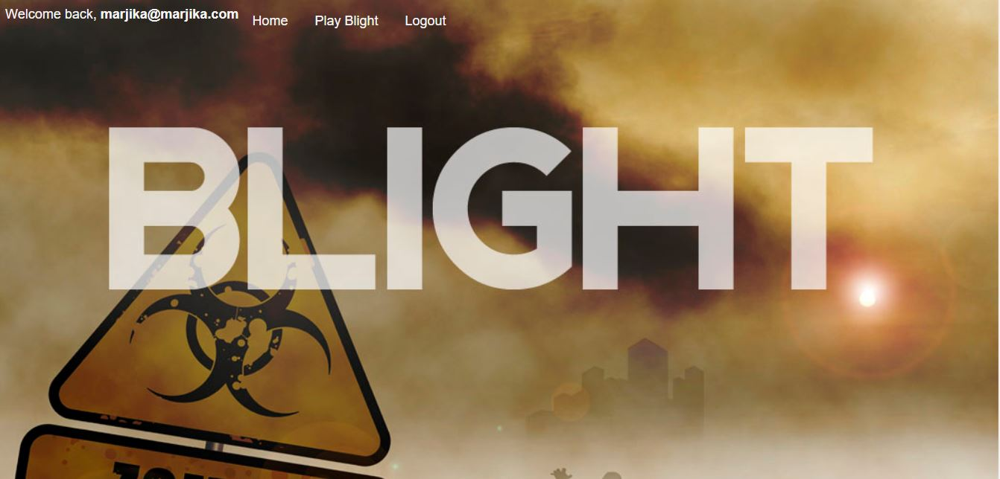

# Blight

### A React full-stack Zombie Apocalypse Game

This full stack MERN application uses react structure to allow a user to play a Zombie game based on some of the logic of the Pandemic Board Game.  It uses Mongo to store the users login information, npm packages include: "axios", "bcrypt", "bcryptjs", "body-parser", "connect-mongo", "dotenv", "express", "express-session", "konva", "mongoose", "morgan", "passport", "passport-google-oauth", "passport-google-oauth20", "passport-local", "react", "react-dom", and "react-router-dom".

### Dependencies

### Components and State

##### About this Application

